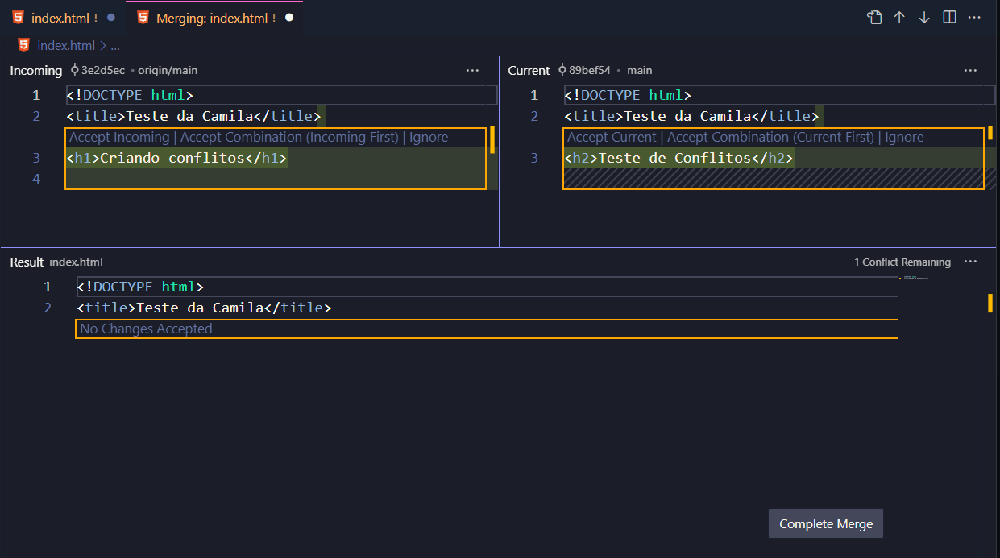
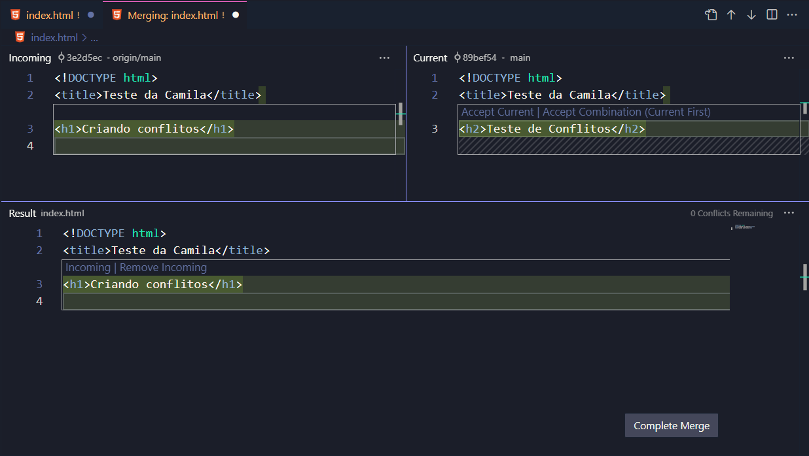
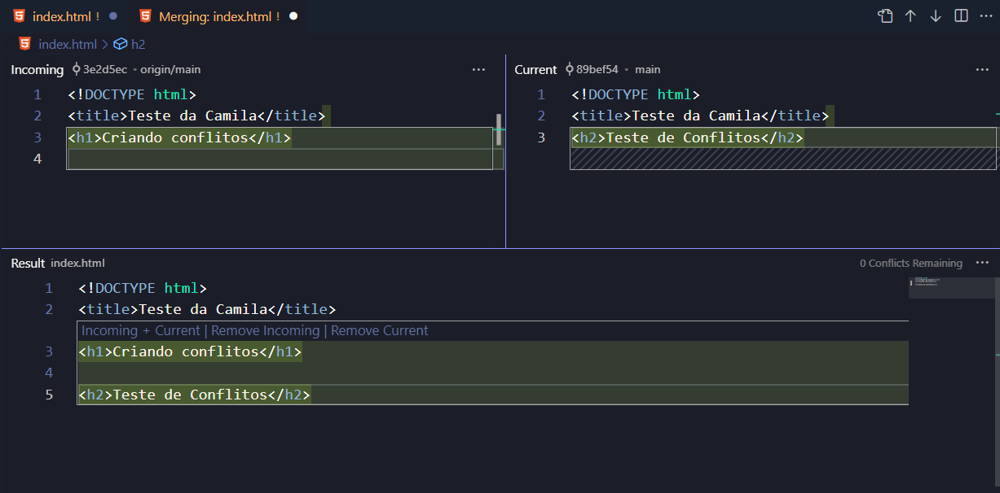
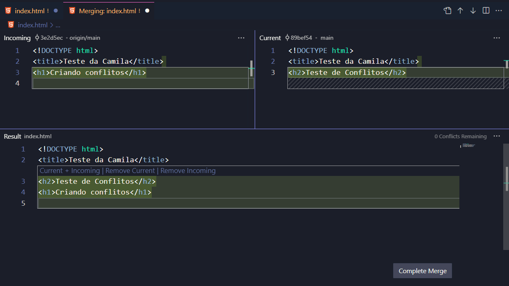

# Comandos Git

## Geração de uma chave SSH

```ssh
ssh-keygen -t ed25519 -C "SEU EMAIL AQUI"
```

## Remover um repositório remoto

```git
git remote remove origin
```

## Alterar o apelido de um repositório remoto

```git
git remote rename origin novo-origin
```

## Alterar a URL de um repositório remoto

```git
git remote set-url origin https://github.com/seu-usuario/seu-repositorio.git
```

## Remover um repositório remoto

```git
git remote remove origin
```

## Adicionar mais de um autor a um commit

> [documentação referente ao assunto](https://docs.github.com/pt/pull-requests/committing-changes-to-your-project/creating-and-editing-commits/creating-a-commit-with-multiple-authors)

```git
$ git commit -m "Adicionar nova funcionalidade.
>
>
Co-authored-by: NOME <nome@email.com>
Co-authored-by: OUTRO-NOME <outro@email.com>"
```

## Comflitos

A tela do Visual Studio Code está dividida em três partes:

- Incoming (remoto): modificações que chegam do repositório remoto.
- Current (local): modificações locais.
- Result (resultado): resultado do merge, ou seja, a resolução dos conflitos de mesclagem. É o estado atual do arquivo.


> Os quadrados na cor amarela em volta do código no campo “Incoming” e “Current” são marcadores de conflito: exibem o conteúdo que apresenta conflito no arquivo.

## Campo Incoming

No campo “Incoming”, acima da linha de código dos marcadores de conflito no campo há outras opções que resultam na alteração do código atual:

- Accept Incoming: aceita modificações oriundas do remoto



- Accept Combination Incoming First: realiza a combinação com as linhas do código do repositório remoto no topo.



- Ignore: ignora as modificações.

## Campo Current

O campo “Current” trabalha com as modificações locais do documento.

- Accept Current: Aceita a modificação local no resultado do documento
- Accept combination Current First: Aceita a combinação local + remoto. Nos resultados a linha de código com a tag `<h2>` fica antes de `<h1>`, comprovando que o código local é inserido primeiro que o remoto.



- Ignore: ignora as modificações no resultado no final.

## Alterar commit

```git
git commit --amend -m "Nova mensagem"
```

## Excluir commit

```git
git reset --hard id_do_commit_anterior
```

**apenas deseja desfazer commits, mas manter as alterações no diretório de trabalho:**

```git
git reset --soft
```

## Desfazer commit

```git
git revert hash-do-ultimo-commit-a-manter
```

## Exibir o histórico completo

```git
git log
```

**Exibir Alterações Detalhadas:**

```git
git log -p
```

**Exibir Apenas Mensagens de Commit:**

```git
git log --oneline
```

## Exibir Apenas Mensagens de Commit

```git
git log -p
```

## Exibir Apenas Mensagens de Commit

```git
git log --oneline
```

## Para saber mais

- [x] [Como o Visual Studio facilita o controle de versão com o Git](https://learn.microsoft.com/pt-br/visualstudio/version-control/git-with-visual-studio?view=vs-2022)

- [x] [Como resolver conflitos de mesclagem no Visual Studio](https://learn.microsoft.com/pt-br/visualstudio/version-control/git-resolve-conflicts?view=vs-2022)

- [x] [Um guia muito útil para mesclar conflitos - em Inglês](https://www.youtube.com/watch?v=HosPml1qkrg)

- [x] [Documentação oficial do git](https://git-scm.com/docs/git-reset/pt_BR)

- [x] [Documentação da Conventional Commits](https://www.conventionalcommits.org/pt-br/v1.0.0-beta.4/)